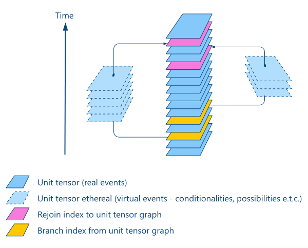

# General directions

Below are general pointers for understanding and building parts of the system that aren't treated in the main readme file.

## Database file: input.db

This database is the connection between OkeuvoLite and the outside world. Anything that has been properly formatted and inserted in this database can be processed by OkeuvoLite.

##### Schema

The schema for *input.db* database can be found in [input_dbSchema.pdf](input_dbSchema.pdf).

##### Parser input mapping

A picture speaks a thousand words, so here's an image that shows how fields in *input.db* can be populated from various parsers - [mainInputSources.pdf](mainInputSources.pdf).

##### Get synset_id from Word Sense Disambiguation (WSD) and Named Entity Recognition (NER)

First, ensure that you are use a WSD tool that disambiguates to Wordnet 3.0 synset_id. The logic for how to obtain the synset_id from WSD and NER is quite simple - see [wordSenseDisambiguationFlow.pdf](wordSenseDisambiguationFlow.pdf).

## Database (output.db) table: *unit_tensor_ethereal_def* 

The *unit_tensor_ethereal_def*  table holds the unit tensor indices for when virtual objects branch off and when they rejoin unit tensor series.

A virtual object is one obtained from a triplet whose mood is not indicative. Virtual objects can be anything that has not happened, such as conditionals and future tense events for example.

The image below shows the main unit tensor graph as well as two ethereal columns that branch of it, do their own thing and then rejoin the main unit tensor column. Each virtual is a new dimension and as many as are necessary should be spawned.

